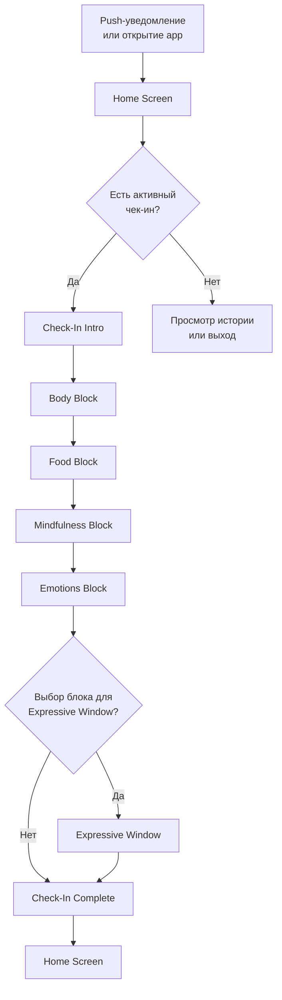
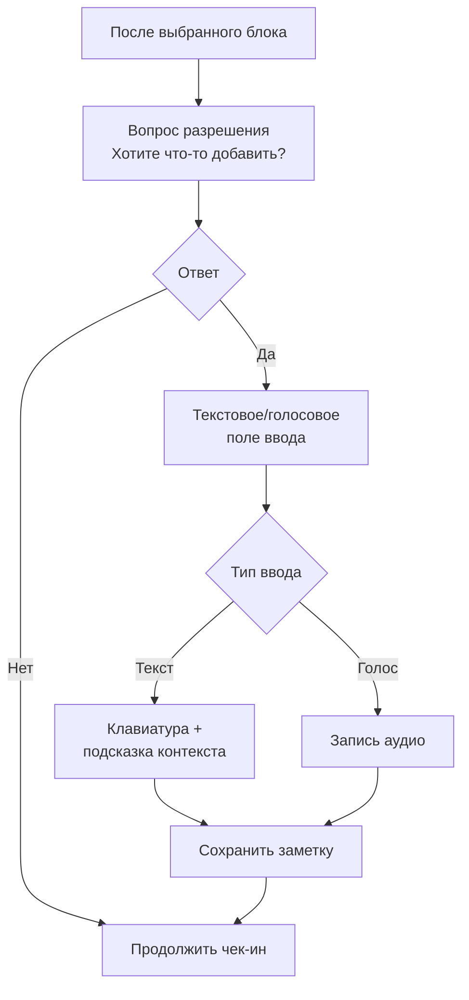
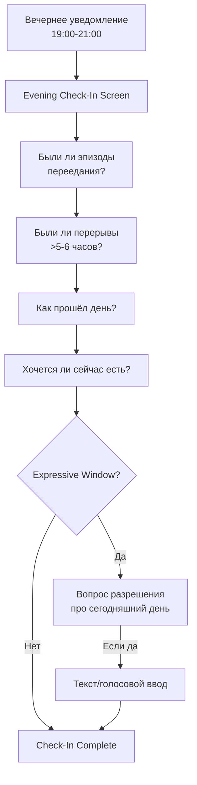
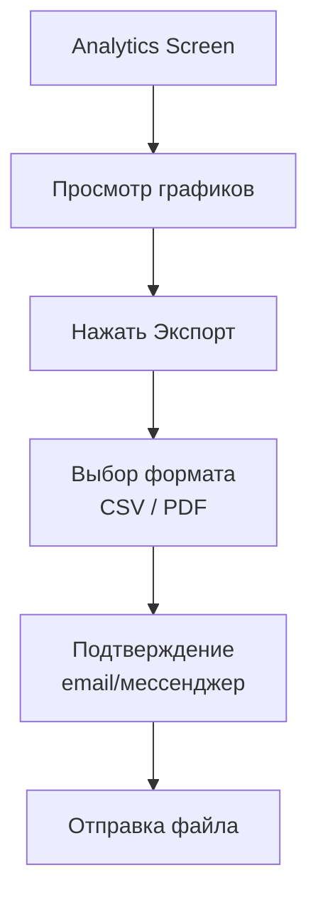

# Gentle Observer — Архитектура приложения

## 1. ОБЗОР ПРОДУКТА

### 1.1 Продуктовая позиция
Приложение **Gentle Observer** — это цифровой спутник для людей с диабетом 2 типа, выполняющий функцию *внешнего мягкого наблюдателя*. Продукт не даёт рекомендаций, не оценивает поведение и не интерпретирует данные. Основная цель — мягкое возвращение внимания к телесным сигналам и сбор структурированных данных для врачей.

### 1.2 Целевой пользователь
| Параметр | Описание |
|----------|----------|
| Демография | Женщины 50–60 лет |
| Состояние | СД2, избыточный вес, эмоциональное переедание |
| Поведение | Низкая готовность вести дневники, тревога перед врачами |
| Технические навыки | Низкая толерантность к сложным интерфейсам |
| Мотивация | Минимальная готовность к самоанализу |

### 1.3 Core Principles (критические)
- ❌ Никаких оценок («хорошо/плохо»)
- ❌ Никаких рекомендаций («пора есть», «надо»)
- ❌ Никаких интерпретаций данных
- ❌ Никаких медицинских утверждений
- ✅ Только фиксация, вопросы, нейтральное сопровождение
- ✅ Минимальная когнитивная нагрузка
- ✅ Добровольность любого расширенного ответа
- ✅ Возможность пропустить любой шаг

---

## 2. АРХИТЕКТУРА ЭКРАНОВ

### 2.1 Навигационная структура

```
├── Splash / Onboarding (разовый)
├── Home (главный экран)
│   ├── Check-In Flow (daytime)
│   │   ├── Body Block
│   │   ├── Food Block
│   │   ├── Mindfulness Block
│   │   ├── Emotions Block
│   │   └── Expressive Window (optional)
│   ├── Evening Check-In Flow
│   └── History View
├── Analytics (экспорт данных)
└── Settings
```

### 2.2 Список экранов

| # | Экран | Назначение |
|---|-------|------------|
| 1 | Splash | Логотип, загрузка |
| 2 | Onboarding | Объяснение принципа работы, запрос разрешений |
| 3 | Home | Центральный экран: статус дня, кнопка чек-ина, доступ к истории |
| 4 | Check-In Intro | Приветствие, начало чек-ина |
| 5 | Body Block | Вопросы о телесных ощущениях |
| 6 | Food Block | Вопросы о приёме пищи |
| 7 | Mindfulness Block | Вопросы о осознанности |
| 8 | Emotions Block | Вопросы о настроении |
| 9 | Expressive Window | Опциональное текстовое/голосовое поле |
| 10 | Check-In Complete | Подтверждение завершения |
| 11 | Evening Check-In | Вечерний опрос |
| 12 | History | Календарь с отметками чек-инов |
| 13 | Analytics | Графики и кнопка экспорта |
| 14 | Export | Выбор формата и подтверждение отправки |
| 15 | Settings | Уведомления, данные, помощь |

---

## 3. USER FLOWS

### 3.1 Основной поток: Daytime Check-In



### 3.2 Поток: Expressive Window



### 3.3 Поток: Evening Check-In



### 3.4 Поток: Экспорт данных



---

## 4. ТЕКСТЫ ЭКРАНОВ И ВОПРОСОВ

### 4.1 Onboarding

**Экран 1: Приветствие**
- Заголовок: «Это приложение — ваш спутник»
- Текст: «Оно не оценивает и не советует. Просто мягко помогает замечать, что происходит с телом и настроением.»
- Кнопка: «Понятно, дальше»

**Экран 2: Как это работает**
- Заголовок: «Короткие чек-ины»
- Текст: «Раз в несколько часов мы будем задавать 4-5 простых вопросов. На ответ — 30 секунд. Можно пропустить любой вопрос или весь чек-ин.»
- Кнопка: «Дальше»

**Экран 3: Разрешения**
- Заголовок: «Уведомления»
- Текст: «Приложение будет присылать короткие напоминания о чек-инах. Можно настроить время или отключить.»
- Кнопки: «Разрешить уведомления» | «Настроить позже»

**Экран 4: Начало**
- Заголовок: «Готово»
- Текст: «Первый чек-ин появится сегодня. Нажмите, когда получите уведомление.»
- Кнопка: «На главный экран»

### 4.2 Home Screen

**Состояние: ожидание чек-ина**
- Заголовок: «Сегодня спокойный день»
- Подзаголовок: «Следующий чек-ин в 11:30»
- Кнопка: «Начать чек-ин сейчас» (если пользователь хочет досрочно)
- Нижние кнопки: «История» | «Аналитика» | «Настройки»

**Состояние: активный чек-ин**
- Заголовок: «Время чек-ина»
- Кнопка основная: «Ответить на вопросы»
- Текст: «Займёт около минуты»

### 4.3 Check-In Flow — Body Block

**Заголовок экрана:** «Как себя чувствует тело»

**Вопрос 1: Голод**
- Текст: «Сейчас чувствуете голод?»
- Варианты: «Да» | «Немного» | «Нет»

**Вопрос 2: Усталость**
- Текст: «Чувствуете усталость?»
- Варианты: «Да» | «Нет»

**Вопрос 3: Напряжение**
- Текст: «Есть напряжение в теле?»
- Варианты: «Да» | «Нет»
- Пропуск: «Пропустить» (внизу экрана)

### 4.4 Check-In Flow — Food Block

**Заголовок экрана:** «О еде»

**Вопрос 1: Время с последнего приёма**
- Текст: «Прошло больше 4 часов с последнего приёма пищи?»
- Варианты: «Да» | «Нет» | «Не уверена»

**Вопрос 2: Ели ли с прошлого чек-ина**
- Текст: «Ели что-то с прошлого чек-ина?»
- Варианты: «Да» | «Нет»

**Вопрос 3: Приятность еды** (показывается только если ответ «Да» на вопрос 2)
- Текст: «Еда была приятной?»
- Варианты: «Да» | «Нормально» | «Не очень»

### 4.5 Check-In Flow — Mindfulness Block

**Заголовок экрана:** «О том, как ели»

**Вопрос 1: Обстановка**
- Текст: «Ели сидя и никуда не спеша?»
- Варианты: «Да» | «Частично» | «Нет»

**Вопрос 2: Вкус**
- Текст: «Чувствовали вкус еды?»
- Варианты: «Да» | «Немного» | «Нет»

### 4.6 Check-In Flow — Emotions Block

**Заголовок экрана:** «Настроение»

**Вопрос 1: Текущее состояние**
- Текст: «Сейчас вы чувствуете себя...»
- Варианты: «Спокойно» | «Уставшей» | «Раздражённой» | «Грустно»

**Вопрос 2: Желание заесть**
- Текст: «Есть желание что-то заесть?»
- Варианты: «Да» | «Нет»

### 4.7 Expressive Window Screens

**Экран разрешения (универсальный)**
- Текст: «Есть ли сейчас что-то, чем вы готовы коротко поделиться?»
- Подтекст: «Полностью по желанию»
- Варианты: «Да, написать» | «Записать голосом» | «Нет, пропустить»

**Подсказки по контексту:**

| После блока | Подсказка в поле ввода |
|-------------|------------------------|
| Body | «Можете описать ощущения, усталость или дискомфорт...» |
| Food | «Можете рассказать о сомнениях, трудностях или приятных моментах...» |
| Mindfulness | «Можете написать, что помогло или мешало...» |
| Emotions | «Можете описать переживания или напряжение...» |
| Evening | «Что-то о сегодняшнем дне...» |

**Экран ввода текста**
- Поле ввода: многострочное, 3 строки видимых
- Подсказка в поле: контекстная (см. таблицу)
- Счётчик: «0/200 символов»
- Кнопка: «Сохранить»

**Экран голосовой записи**
- Иконка: микрофон
- Текст: «Нажмите и удерживайте для записи»
- Максимум: 60 секунд
- Кнопка: «Сохранить запись»

### 4.8 Evening Check-In

**Заголовок:** «Вечерний чек-ин»

**Вопрос 1: Переедание**
- Текст: «Сегодня были эпизоды, когда ели больше, чем хотели?»
- Варианты: «Да» | «Нет» | «Не уверена»

**Вопрос 2: Долгие перерывы**
- Текст: «Были сегодня перерывы между едой больше 5-6 часов?»
- Варианты: «Да» | «Нет» | «Не помню»

**Вопрос 3: Общее состояние дня**
- Текст: «Сегодняшний день был...»
- Варианты: «Спокойным» | «Тяжёлым» | «Очень уставшим»

**Вопрос 4: Текущий голод**
- Текст: «Сейчас хочется есть?»
- Варианты: «Да» | «Немного» | «Нет»

**Вопрос 5: Expressive Window**
- Текст: «Хочется ли вам что-то добавить про сегодняшний день?»
- Варианты: «Да» | «Нет»

### 4.9 Check-In Complete

**Универсальный экран завершения**
- Иконка: мягкая галочка или волна
- Текст: «Записано»
- Подтекст: «Спасибо. Следующий чек-ин в [время].»
- Кнопка: «На главный экран»

**Альтернативный текст (если мало ответов):**
- Текст: «Спасибо. Можно ответить на больше вопросов в следующий раз — или совсем не отвечать. Как будет комфортно.»

### 4.10 Analytics Screen

**Заголовок:** «Ваши данные»

**График 1: Интервалы между приёмами пищи**
- Подпись: «Часы между едой»
- Тип: линейный график по дням

**График 2: Частота состояний**
- Подпись: «Голод и усталость»
- Тип: столбчатая диаграмма

**График 3: Настроение**
- Подпись: «Настроение и желание заесть»
- Тип: точечная диаграмма

**Кнопка экспорта:** «Выгрузить для врача»

**Примечание под графиками:**
- Текст: «Эти данные — только для вас. Их видите вы и тот, кому вы решите показать.»

### 4.11 Export Screen

**Заголовок:** «Выгрузка данных»

**Выбор формата:**
- Опция 1: «Таблица (CSV)»
- Опция 2: «PDF с графиками»

**Выбор периода:**
- Опция: «Последние 7 дней» | «Последние 30 дней» | «Всё время»

**Кнопка:** «Поделиться»
- Открывает системное меню: email, мессенджеры, сохранение

### 4.12 Settings

**Раздел Уведомления**
- Заголовок: «Напоминания о чек-инах»
- Тоггл: включить/выключить
- Время вечернего чек-ина: выбор (19:00–21:00)

**Раздел Данные**
- Кнопка: «Экспорт всех данных»
- Кнопка: «Удалить все данные»

**Раздел Информация**
- Кнопка: «О приложении»
- Кнопка: «Предупреждение» (disclaimer)

---

## 5. ЛОГИКА ЧЕК-ИНОВ И EXPRESSIVE WINDOWS

### 5.1 Расписание push-уведомлений

| Тип | Частота | Время | Содержание |
|-----|---------|-------|------------|
| Дневной чек-ин | каждые 1.5–2 часа | 09:00–19:00 | «Время чек-ина» |
| Вечерний чек-ин | 1 раз в день | 19:00–21:00 (настраивается) | «Вечерний чек-ин» |

**Примечание:** Уведомления не содержат оценок или рекомендаций. Только нейтральное приглашение.

### 5.2 Правила показа Expressive Windows

**Ограничения частоты:**
- Максимум 1 Expressive Window на один чек-ин
- Максимум 2 Expressive Windows в день
- Не показывать, если пользователь ранее отказал 3 раза подряд

**Выбор блока для Expressive Window:**
- Приложение случайным образом выбирает 1 блок после завершения всех обязательных вопросов
- Исключение: если пользователь выбрал «Да» на вопрос о желании заесть — предпочтение блоку Emotions
- Исключение: если прошло >5 часов с последнего приёма — предпочтение блоку Food

**Порядок действий:**
1. Пользователь отвечает на все вопросы чек-ина
2. Показывается экран разрешения Expressive Window
3. Если «Нет» — завершение чек-ина
4. Если «Да» — открывается окно ввода с контекстной подсказкой
5. После сохранения — завершение чек-ина

### 5.3 Условия пропуска

**Доступные пропуски:**
- Любой отдельный вопрос: кнопка «Пропустить»
- Любой блок целиком: свайп или кнопка «Дальше»
- Весь чек-ин: закрытие приложения или «Закончить позже»
- Expressive Window: кнопка «Нет»

**Поведение при пропуске:**
- Нет никаких предупреждений или уговоров
- Нет последствий для будущих чек-инов
- Данные сохраняются частично (только отвеченное)

---

## 6. СТРУККТУРА ДАННЫХ

### 6.1 Сущности

```typescript
// Пользователь
interface User {
  id: string;
  createdAt: Date;
  settings: UserSettings;
}

// Настройки
interface UserSettings {
  notificationsEnabled: boolean;
  eveningCheckInTime: Time; // 19:00 - 21:00
  expressiveWindowFrequency: 'normal' | 'reduced';
}

// Чек-ин
interface CheckIn {
  id: string;
  userId: string;
  type: 'daytime' | 'evening';
  timestamp: Date;
  completedAt?: Date;
  skipped: boolean;
  blocks: {
    body?: BodyBlock;
    food?: FoodBlock;
    mindfulness?: MindfulnessBlock;
    emotions?: EmotionsBlock;
  };
  expressiveWindow?: ExpressiveEntry;
}

// Блок: Тело
interface BodyBlock {
  hunger: 'yes' | 'somewhat' | 'no' | null;
  fatigue: 'yes' | 'no' | null;
  tension: 'yes' | 'no' | null;
}

// Блок: Еда
interface FoodBlock {
  hoursSinceLastMeal: 'yes' | 'no' | 'unsure' | null;
  ateSinceLastCheckIn: 'yes' | 'no' | null;
  foodEnjoyment?: 'yes' | 'okay' | 'not_really' | null;
}

// Блок: Осознанность
interface MindfulnessBlock {
  ateMindfully: 'yes' | 'partially' | 'no' | null;
  tastedFood: 'yes' | 'somewhat' | 'no' | null;
}

// Блок: Эмоции
interface EmotionsBlock {
  mood: 'calm' | 'tired' | 'irritated' | 'sad' | null;
  urgeToEat: 'yes' | 'no' | null;
}

// Вечерний чек-ин (расширение)
interface EveningCheckIn extends CheckIn {
  overeatingEpisodes: 'yes' | 'no' | 'unsure' | null;
  longGaps: 'yes' | 'no' | 'dont_remember' | null;
  dayOverall: 'calm' | 'hard' | 'exhausting' | null;
  currentHunger: 'yes' | 'somewhat' | 'no' | null;
}

// Expressive Window запись
interface ExpressiveEntry {
  id: string;
  checkInId: string;
  blockType: 'body' | 'food' | 'mindfulness' | 'emotions' | 'evening';
  contentType: 'text' | 'voice';
  content: string; // текст или путь к аудио
  timestamp: Date;
}
```

### 6.2 Структура для экспорта (CSV)

```csv
date,check_in_type,hunger,fatigue,tension,hours_since_meal,ate_since_last,food_enjoyment,ate_mindfully,tasted_food,mood,urge_to_eat,overeating_episodes,long_gaps,day_overall,current_hunger,expressive_note
2024-01-15,daytime,yes,no,no,yes,yes,yes,yes,yes,calm,no,,,,,,
2024-01-15,evening,,,,,,,,,,,no,no,calm,somewhat,"Сегодня был спокойный день"
```

### 6.3 Метрики для аналитики (без интерпретации)

| Метрика | Описание |
|---------|----------|
| meal_intervals | Время между отметками «да» на ateSinceLastCheckIn |
| hunger_frequency | % чек-инов с ответом «да»/«немного» на голод |
| fatigue_frequency | % чек-инов с ответом «да» на усталость |
| mood_distribution | Распределение ответов по настроению |
| urge_correlation | Соответствие настроения и желания заесть (без вывода) |

---

## 7. UX-ПРИНЦИПЫ ДЛЯ ПОЛЬЗОВАТЕЛЕЙ 50+

### 7.1 Визуальный дизайн

| Принцип | Реализация |
|---------|------------|
| Размер шрифта | Минимум 18px для текста, 24px для вопросов |
| Контраст | 4.5:1 минимум (WCAG AA) |
| Цветовые индикаторы | Никогда не использовать только цвет (всегда + текст/иконка) |
| Кнопки | Минимум 56px в высоту, чёткие границы |
| Расстояние между элементами | Минимум 12px |
| Типографика | Санс-сериф, один шрифт на всё приложение |

### 7.2 Интерактивность

| Принцип | Реализация |
|---------|------------|
| Время отклика | Мгновенная визуальная обратная связь на нажатие |
| Область нажатия | Кнопки занимают всю ширину экрана |
| Жесты | Только тапы, свайпы — дополнительно, не обязательно |
| Ошибки | Никаких «ошибок» — только информация |
| Прогресс | Индикатор «вопрос X из Y» |

### 7.3 Когнитивная нагрузка

| Принцип | Реализация |
|---------|------------|
| Один вопрос — один экран | Никаких списков вопросов |
| Быстрые ответы | Максимум 3 варианта на экран |
| Ясные метки | Кнопки с полным текстом, не иконки |
| Последовательность | Одинаковый порядок блоков всегда |
| Повторение | Ключевые термины повторяются без синонимов |

### 7.4 Эмоциональная безопасность

| Принцип | Реализация |
|---------|------------|
| No guilt UX | Никаких красных цветов, восклицательных знаков |
| Нейтральные формулировки | «Ели ли» вместо «Держались ли диеты» |
| Контроль | Всегда видна кнопка пропуска |
| Отсутствие давления | Никаких напоминаний «вы пропустили» |
| Положительное подкрепление | «Записано» вместо «Молодец» |

### 7.5 Доступность

- Поддержка VoiceOver/TalkBack
- Возможность увеличения текста
- Поддержка режима высокого контраста
- Нет зависимости от цвета для понимания

---

## 8. DISCLAIMER (ПРЕДУПРЕЖДЕНИЕ)

### 8.1 Полный текст

```
ПРЕДУПРЕЖДЕНИЕ

Приложение Gentle Observer не является медицинским 
продуктом и не предназначено для диагностики, лечения 
или профилактики заболеваний.

Приложение не даёт:
• Медицинских рекомендаций
• Советов по питанию
• Рекомендаций по лечению диабета
• Интерпретации ваших данных

Все данные, собираемые приложением, предназначены только 
для вашего личного использования и для предоставления 
вашему лечащему врачу по вашему решению.

Приложение не заменяет консультацию с врачом. 
Все вопросы, касающиеся вашего здоровья, питания и 
лечения, необходимо обсуждать с квалифицированным 
специалистом.

Если у вас есть сомнения по поводу состояния здоровья 
или вы испытываете недомогание, обратитесь к врачу.
```

### 8.2 Размещение

- При первом запуске (Onboarding, отдельный экран)
- В разделе «Настройки» → «Предупреждение»
- В футере экспортируемых данных (PDF)

---

## 9. ТЕХНИЧЕСКИЕ ЗАМЕЧАНИЯ

### 9.1 Локальное хранение

- Все данные хранятся локально на устройстве
- Возможность резервного копирования (по желанию пользователя)
- Нет обязательной регистрации

### 9.2 Push-уведомления

- Локальные уведомления (не требуют сервера)
- Уважение к Do Not Disturb режиму
- Не отправляются ночью (22:00–08:00)

### 9.3 Безопасность данных

- Данные не передаются третьим лицам
- Экспорт только по инициативе пользователя
- Возможность полного удаления

### 9.4 Совместимость с Android 4.0+

**Целевая платформа:**
- Минимальная версия: Android 4.0 (API 14, Ice Cream Sandwich)
- Целевая версия: Android 4.4+ (API 19, KitKat)
- Максимальная тестируемая: Android 14 (API 34)

**Требования совместимости:**
- Приложение должно запускаться на Android 4.0 без сбоев
- Все базовые функции доступны на Android 4.0+
- Fallback для функций, недоступных в старых версиях:
  - Уведомления: использование NotificationCompat
  - Хранение: SQLite с поддержкой старых API
  - Аудио: MediaRecorder с проверкой возможностей
- Тестирование на реальных устройствах с Android 4.x перед релизом

**Рекомендуемый стек технологий:**
| Компонент | Технология | Причина |
|-----------|------------|---------|
| Язык | Java 7 / Kotlin 1.3+ | Совместимость с Android 4.0 |
| UI | XML Layouts + Support Library | Стабильность на старых устройствах |
| База данных | SQLite (Room 1.1.x) | Локальное хранение |
| Уведомления | NotificationCompat | Совместимость API 14+ |
| Графики | MPAndroidChart 2.x | Поддержка Android 4.0+ |

### 9.5 Адаптивный дизайн (все экраны и ориентации)

**Поддерживаемые размеры экранов:**
- Минимум: 3.5" (320×480 dp, ldpi/mdpi)
- Оптимум: 4.5–6" (phone)
- Максимум: 10" (tablet, планшетный режим)

**Категории экранов:**
| Категория | Размер | Минимальная ширина | Адаптация |
|-----------|--------|-------------------|-----------|
| Small | 3.5–4.0" | 320dp | Компактный UI, прокрутка |
| Normal | 4.0–5.5" | 360dp | Стандартный UI |
| Large | 5.5–7" | 480dp | Увеличенные отступы |
| Tablet | 7–10" | 600dp | Двухпанельный режим |

**Адаптация компонентов:**

**Кнопки:**
- Минимальная высота: 56dp (48dp для Small экранов)
- Минимальная ширина касания: 48dp
- Отступы между кнопками: мин. 12dp (8dp на Small)
- Поля по бокам экрана: 16dp (12dp на Small)

**Текст:**
- Заголовки: 24sp (22sp на Small)
- Вопросы: 20sp (18sp на Small)
- Кнопки/ответы: 18sp (16sp на Small)
- Подсказки: 14sp (12sp на Small)

**Реализация:**
```xml
<!-- values/dimens.xml -->
<dimen name="button_height">56dp</dimen>
<dimen name="text_question">20sp</dimen>

<!-- values-small/dimens.xml -->
<dimen name="button_height">48dp</dimen>
<dimen name="text_question">18sp</dimen>

<!-- values-large/dimens.xml -->
<dimen name="button_height">64dp</dimen>
<dimen name="text_question">22sp</dimen>
```

### 9.6 Обработка ориентаций

**Поддерживаемые ориентации:**
- Портрет (основная)
- Ландшафт (опционально, для планшетов)

**Портрет (Phone):**
- Кнопки занимают всю ширину с отступами 16dp
- Один вопрос на экран, вертикальная прокрутка если нужно
- Нижняя навигация: кнопки внизу экрана

**Ландшафт (Phone):**
- Фиксированная портретная ориентация рекомендуется
- Или: центрирование контента, ограничение максимальной ширины до 480dp
- Кнопки располагаются горизонтально, если помещаются

**Планшет (обе ориентации):**
- Максимальная ширина контента: 600dp (центрирование)
- Кнопки увеличены для комфортного использования
- Двухпанельный режим: список чек-инов слева, детали справа

**Техническая реализация ориентаций:**
```xml
<!-- AndroidManifest.xml -->
<!-- Для телефонов: фиксированная портретная -->
<activity android:name=".CheckInActivity"
    android:screenOrientation="portrait"
    android:configChanges="orientation|screenSize" />

<!-- Для планшетов: адаптивная -->
<activity android:name=".HistoryActivity"
    android:configChanges="orientation|screenSize" />
```

**Альтернативные layout для ориентаций:**
```
res/
├── layout/              # Портрет (phone)
│   └── activity_checkin.xml
├── layout-land/         # Ландшафт (phone + tablet)
│   └── activity_checkin.xml
├── layout-large/        # Планшеты портрет
│   └── activity_checkin.xml
├── layout-large-land/   # Планшеты ландшафт
│   └── activity_checkin.xml
└── layout-sw600dp/      # 7"+ планшеты
    └── activity_checkin.xml
```

### 9.7 Рекомендации по тестированию

**Минимальный набор тестовых устройств:**
| Устройство | Android | Размер | DPI | Приоритет |
|------------|---------|--------|-----|-----------|
| Эмулятор API 14 | 4.0 | 4" | mdpi | Критично |
| Samsung Galaxy S3 | 4.3 | 4.8" | xhdpi | Высокий |
| Xiaomi Redmi 4A | 6.0 | 5" | hdpi | Высокий |
| Samsung Galaxy J2 | 5.1 | 4.7" | mdpi | Средний |
| Планшет 10" | 7.0+ | 10" | xhdpi | Средний |

**Тестовые сценарии адаптивности:**
- [ ] Все экраны отображаются без обрезки на 3.5" (320×480)
- [ ] Кнопки нажимаются комфортно на всех размерах
- [ ] Текст читается без масштабирования на ldpi/mdpi
- [ ] Прокрутка работает если контент не помещается
- [ ] Поворот экрана не сбрасывает прогресс чек-ина
- [ ] Планшетный режим использует пространство эффективно

---

## 10. ПРИЛОЖЕНИЕ: ИНФОРМАЦИЯ ДЛЯ РАЗРАБОТЧИКОВ

### 10.1 Экраны с приоритетами разработки

| Приоритет | Экран | Рationale |
|-----------|-------|-----------|
| P0 | Home, Body Block, Check-In Complete | MVP функционал |
| P0 | Evening Check-In | Ключевая метрика |
| P1 | Food Block, Emotions Block | Полный набор данных |
| P1 | History, Analytics | Обратная связь пользователю |
| P2 | Expressive Window | Дополнительная ценность |
| P2 | Mindfulness Block | Расширенные данные |
| P3 | Settings, Onboarding | Оптимизация опыта |

### 10.2 Acceptance Criteria (примеры)

**Для Body Block:**
- [ ] Пользователь может выбрать только один ответ на вопрос
- [ ] Кнопка «Пропустить» видна всегда
- [ ] Ответ сохраняется при переходе к следующему экрану
- [ ] Нет обязательных полей
- [ ] Время заполнения ≤ 20 секунд

**Для Expressive Window:**
- [ ] Показывается только после разрешения
- [ ] Не чаще 1 раза на чек-ин
- [ ] Текстовое поле поддерживает многострочность
- [ ] Голосовая запись ограничена 60 секундами
- [ ] Пропуск не влияет на завершение чек-ина

---

*Документ создан: 2024*
*Версия: 1.0*
*Статус: Готов к разработке MVP*
